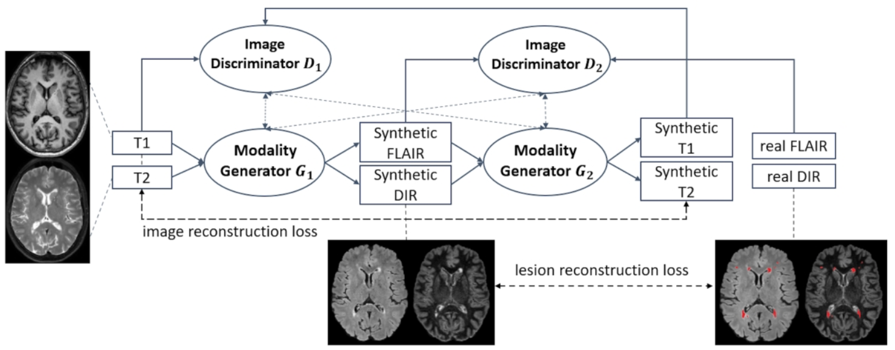

## A Tutorial on Synthesizing FLAIR and DIR for Multiple Sclerosis Patients 
This is a tutorial on synthesizing FLAIR and DIR using generative adversarial networks (_AttenGAN_) and the combination of T1 and T2. 


First, make sure you are in a [virtual environment](https://www.geeksforgeeks.org/set-up-virtual-environment-for-python-using-anaconda/).
Then install the neccessary packages via:  
```
pip install -r requirements.txt
```
